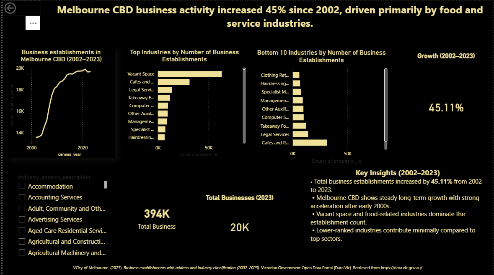

# Melbourne CBD Business Establishments Analysis (2002–2023)

> Two decades of City of Melbourne business activity — long-term growth, industry dominance, and structural shifts surfaced from 21 years of public data.


---

## 📌 Project Summary

How has Melbourne's CBD evolved as a place to do business over the last two decades?

This project uses publicly available data from the **City of Melbourne Open Data Platform** to investigate the structural growth, decline, and shifts in business establishments across the CBD between 2002 and 2023. It moves beyond surface-level counts to surface the kind of insights an urban policy analyst, commercial property strategist, or municipal economic-development team would care about.

---

## 📊 Dashboard Preview



*Interactive Power BI dashboard with year/industry/subdistrict slicers and custom DAX measures for growth rate, share-of-total, and year-over-year change.*

---

## 🎯 Business Questions Answered

| # | Question | Why it matters |
|---|---|---|
| 1 | Which Melbourne areas have the highest density of business establishments? | Informs zoning, infrastructure, and commercial property investment decisions |
| 2 | How has total business activity changed from 2002 to 2023? | Long-run growth signal for council strategy and investor confidence |
| 3 | Which industries dominate the region? | Identifies CBD's economic identity and dependency risks |
| 4 | Which industries are growing or declining significantly? | Early signal for emerging sectors and structural decline |
| 5 | What structural changes can be observed over time? | Surfaces shocks (e.g. 2022 dip) and forward-looking risk indicators |

---

## 🎯 Key Findings

| # | Finding | Strategic Implication |
|---|---|---|
| 1 | **Business establishments grew 45.11%** between 2002 and 2023 | CBD remains a long-term growth engine despite cyclical pressures |
| 2 | **Cafés & Restaurants are the leading active industry category** | Hospitality is the dominant economic identity of the CBD |
| 3 | **Service-based industries show consistent expansion** | Knowledge economy is steadily replacing traditional retail |
| 4 | **Vacant space increased significantly** over the period | Forward operational risk — rising vacancy alongside growth signals structural mismatch (oversupply, post-COVID hybrid work) |
| 5 | **2022 showed a temporary decline** before recovery in 2023 | COVID hangover effect; rebound confirms underlying CBD resilience |

---

## 🗂️ Repository Structure

```
melbourne-cbd-business-analysis/
├── README.md                       # This file
├── analysis.py                     # Python analysis script (cleaning, aggregation, EDA)
└── Dashboard.png                   # Power BI dashboard export
```

---

## 🛠️ Methodology

### Step 1 — Data Acquisition
Pulled raw establishment data from the **City of Melbourne Open Data Platform** covering 2002–2023. Initial inspection performed in Excel to understand schema, completeness, and reporting frequency.

### Step 2 — Data Cleaning (Python / pandas)
- Resolved year-on-year schema drift (column renames, category reclassifications)
- Standardised industry category labels for consistent year-over-year comparison
- Handled missing values for transitional years
- Validated total establishment counts against published City of Melbourne reports

### Step 3 — Exploratory Analysis
- Computed year-over-year growth rates and identified inflection points
- Aggregated by industry category to identify dominant and emerging sectors
- Cross-referenced vacant space trends against active business growth

### Step 4 — Visualisation (Power BI)
- Multi-page dashboard: Overview, Industry Deep-Dive, Geographic View, Trend Analysis
- Slicers for year range, industry category, and CBD subdistrict
- Custom DAX measures for growth rate, share-of-total, and YoY change

### Step 5 — Insight Synthesis
Translated raw findings into stakeholder-ready recommendations framed for a council, commercial property, or economic-development audience.

---

## 🧰 Tech Stack

- **Python 3.10** — pandas, numpy for data manipulation and aggregation
- **Power BI** — interactive dashboard with custom DAX measures
- **Microsoft Excel** — initial data inspection and validation
- **City of Melbourne Open Data Platform** — primary data source

---

## 📊 What This Project Demonstrates

This was my **first end-to-end portfolio project** — and intentionally so. It demonstrates the foundational skills every Data Analyst needs before tackling more advanced work:

- **Public data acquisition and validation** against authoritative sources
- **Cross-year schema reconciliation** — a real-world challenge often glossed over in tutorials
- **Translating raw counts into strategic narrative** — the difference between a spreadsheet and an insight
- **Stakeholder-grade dashboard design** in Power BI
- **Independent project execution** without a brief, scope, or template

Subsequent projects ([Fashion Retail Intelligence](https://github.com/Ahmed-Al-Rafsan/Fashion-Retail-Intelligence) and [Customer Segmentation & RFM Analysis](https://github.com/Ahmed-Al-Rafsan/Customer-Segmentation-RFM-Analysis)) build on this foundation with deeper SQL, advanced segmentation, and customer lifetime value modelling.

---

## 📜 Data Source & Acknowledgement

Data sourced from the [City of Melbourne Open Data Platform](https://data.melbourne.vic.gov.au/) under the Creative Commons Attribution 4.0 International licence. This project is for portfolio and educational purposes only.

---

## 👤 Author

**Ahmed Al Rafsan** — Data Analyst | MBIS (Data Analytics), AIH Melbourne

🔗 [LinkedIn](https://www.linkedin.com/in/ahmed-al-rafsan-/) · 💻 [GitHub](https://github.com/Ahmed-Al-Rafsan) · ▶️ [YouTube — Rafsan Data & AI Lab](https://www.youtube.com/@AhmedAlRafsan)

---

*Independent portfolio project. Data and visualisations are for educational purposes only.*
